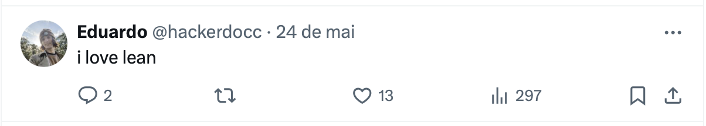
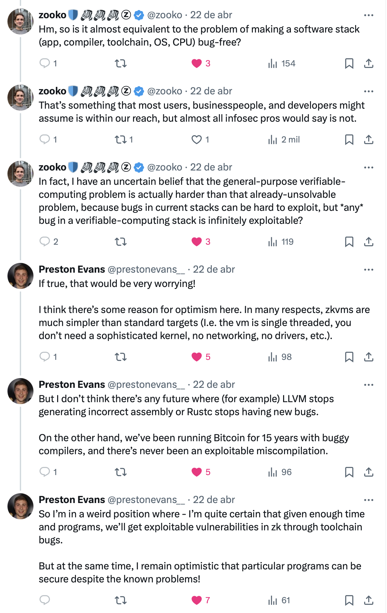
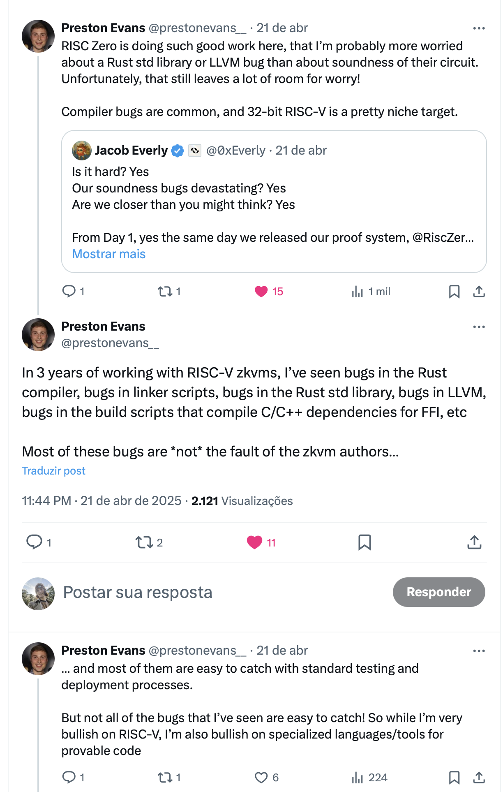

<!-- header: 1. title -->

<!-- # zkVMs formal verification -->
## Cryptography agenda ZuBerlin 2025
### 17th of June (Tuesday)
- `16:20` Talk: Formal Verification. By Eduardo Bonilha `(Main stage)`

---

<!-- header: 2. introductory slide -->

1. who am i
    - Eduardo, like maths, developer (mention I built a verifier?)
    
---

<!-- header: 2. introductory slide -->

2. why am I doing a talk on this topic?..

---
<!-- header: 2. introductory slide -->

<!-- figure out how to do a text transition here -->
2. why am I doing a talk on this topic?..
    - wait this guy doesn't even work on formally verifying zkVMs why is he doing a talk on this, am I being scammed? who let this guy in? wait he's saying exactly what's written on the slide? is this a standup? I might leave...

---
<!-- header: 3. I love Lean tweet -->



```lean-4
def partition.insert_recurrence
  (x: X)
  (x_not_in_S: x ∉ S):
  partition (insert x S) ≃ Σ (s : S.powerset), partition (S \ s)
```

```lean-4
theorem bell_numbers_count_partitions:
  ∀ n : ℕ,
  ∀ S : Finset X,
    S.card = n → finset_partition_count X S = bell n
```
---
<!-- header: 4. "ok but now fr" -->

1. cryptography needs formal verification, maybe more than anything else
    1. because it's tricky
    2. because it's critical

---
<!-- header: 4. "ok but now fr" -->

2. programmable cryptography, especially so
    1. it's going to be used by non-formally trained practicioners of cryptography
    2. going to be deployed across a variety of sensitive protocols

---
<!-- header: 4. "ok but now fr" -->

3. I had this existential fear where it seemed very hard to completely trust zkVMs
    1. they all depend on complex compiler pipelines
    2. soundness bugs are catasthropic if unnoticed (and hard to notice) (RISC0 blog) (I need to elaborate this argument some point further down, I can't just state this)
    3. tie-in to the ISA debate, zooko/preston evans threads (? maybe later)

---
<!-- header: 4. "ok but now fr" -->

4. so I was invested in this and wanted to figure it out
<!-- fix positioning later -->


---

---
<!-- header: 5. brief intro to zkVMs -->

5. brief intro to zkVMs

---
<!-- header: 5. brief intro to zkVMs -->

5. brief intro to zkVMs
	1. nah you guys got this

---
<!-- header: 5. brief intro to zkVMs -->

5. brief intro to zkVMs
	1. nah you guys got this
    2. ok ok, what's important about them for this talk is that:

---
<!-- header: 5. brief intro to zkVMs -->

1. they verify _traces of computation_
    - (this sublety is going to be part of an elegant analogy later)
2. most of them target RISC-V
3. and thus they model von Neumann architecture machines

---
<!-- header: 6. "brief" intro to formal verification -->

6. "brief" intro to formal verification
	1. what even is formal verification?
    2. formal model -> prove properties

IMPORTANT: COMPLETE THIS LATER (curry-howard, dependent-types, lambda cube etc)

---
<!-- header: 6. "brief" intro to formal verification -->

6. "brief" intro to formal verification
	1. what even is formal verification?
    2. formal model -> prove properties

---
<!-- header: 7. what does it actually mean to formally verify a zkVM -->

7. what does it actually mean to formally verify a xzkVM
    1. soundness & completness
        - equivalence between circuit & reference implementation/spec
	2. security proof of the ZK construction (the so called "backend")
	3. certified compilation pipeline
        - circuit -> constraints
        - constraints -> prover & verifier
		    - (prover can include witness gen)

IMPORTANT: include diagrams

---
<!-- header: 7. what does it actually mean to formally verify a zkVM -->

7. what does it actually mean to formally verify a xzkVM
    1. soundness & completness
        - equivalence between circuit & reference implementation/spec
	2. security proof of the ZK construction (the so called "backend")
	3. certified compilation pipeline
        - circuit -> constraints
        - constraints -> prover & verifier
		    - (prover can include witness gen)
    4. (optional, recommended): a way to also prove properties about the programs running on this VM

IMPORTANT: include diagrams

---
