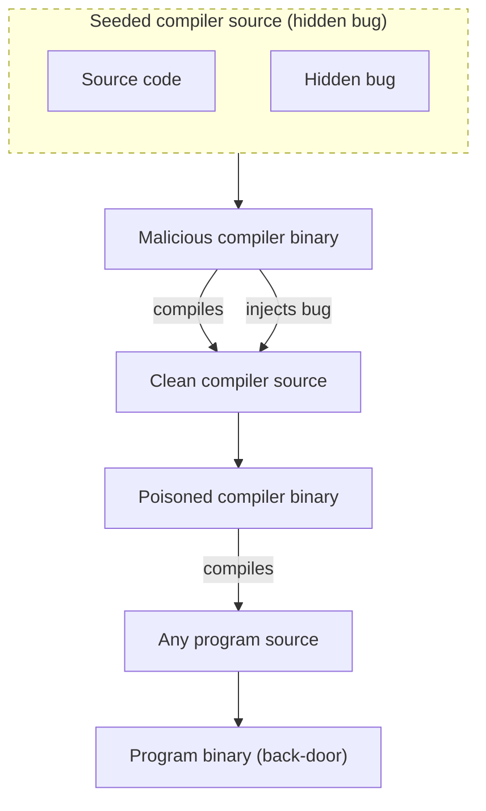
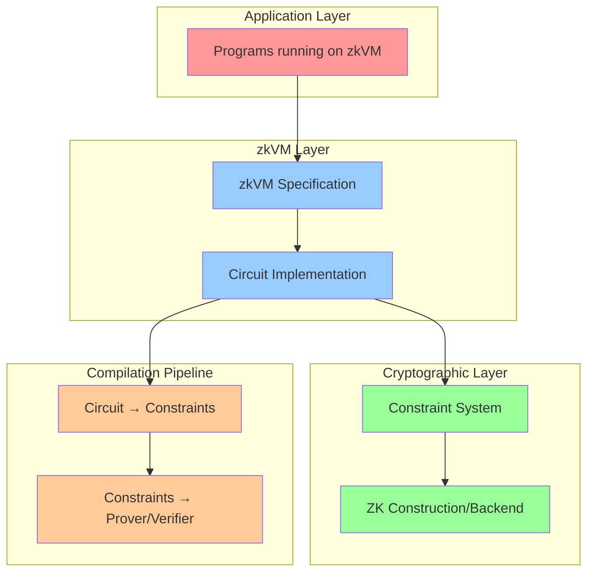
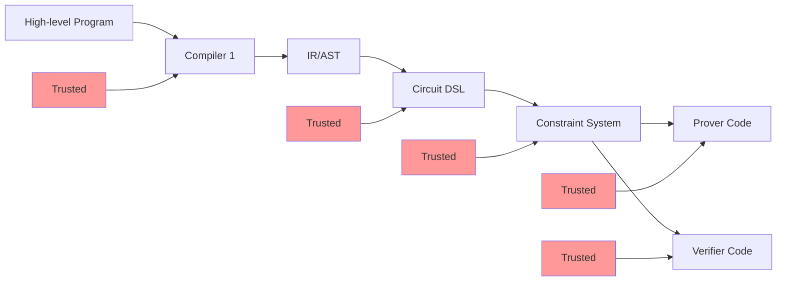
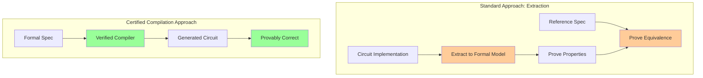
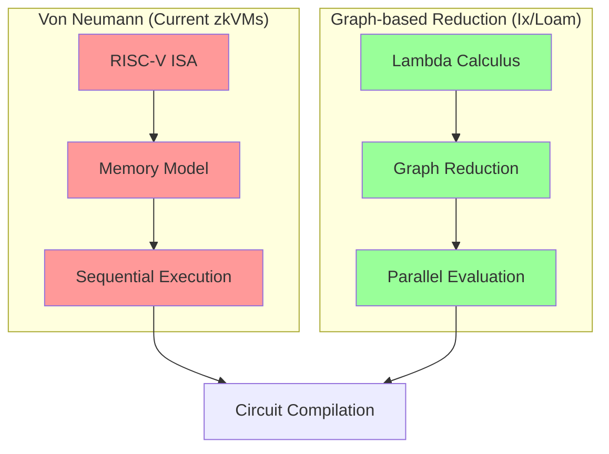
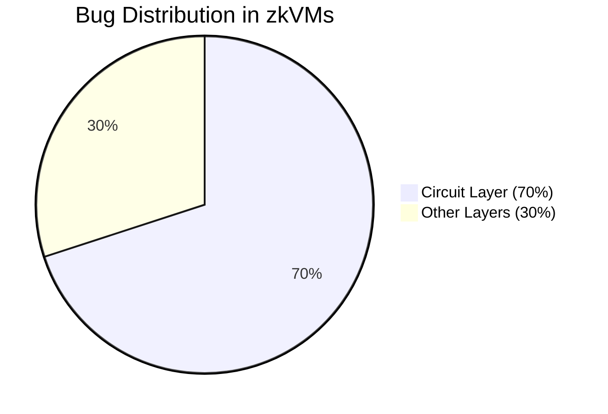
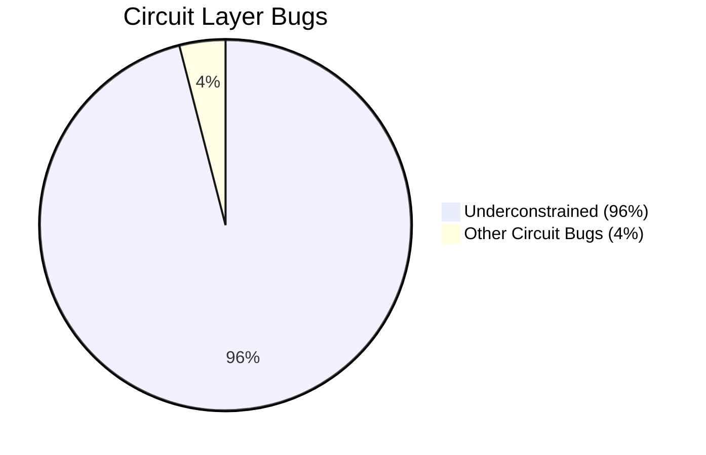
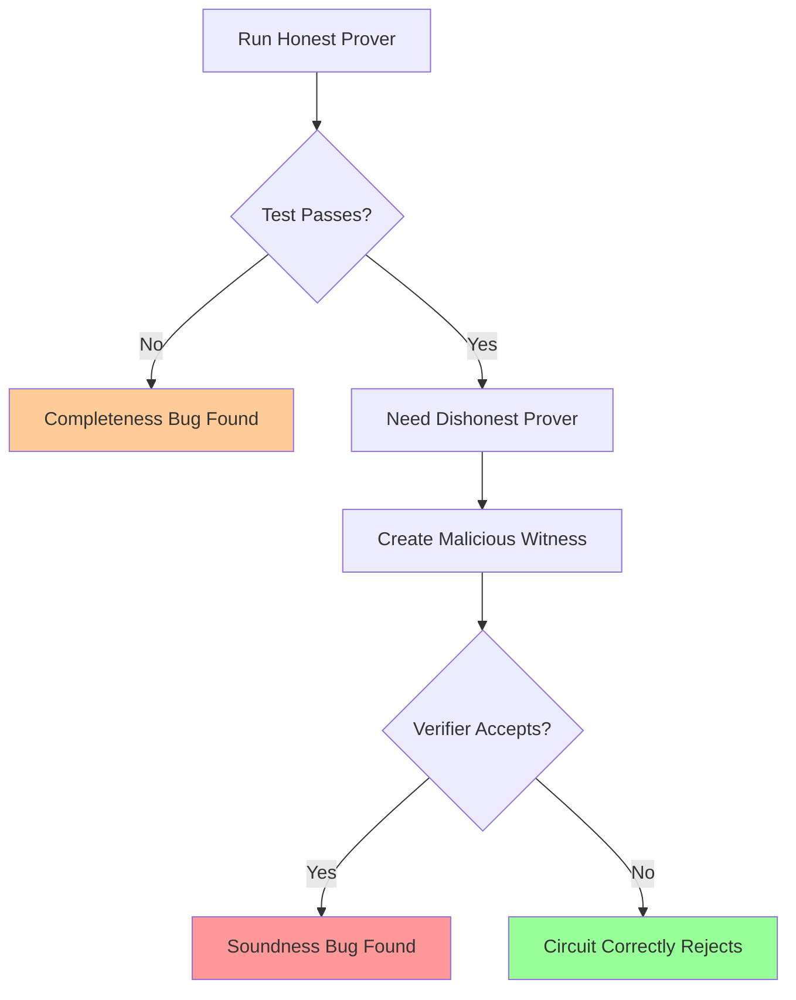

# Formal Verification of zkVMs - Diagrams

## 1. zkVM Verification Layers





## 2. Compilation Pipeline (Trust Chain)



## 3. Extraction vs Equivalence Proof Approaches



## 4. Von Neumann vs Graph-based Reduction



## 5. Bug Distribution (from RISC0 blog)





## 6. Formal Verification Tool Ecosystem

```mermaid
graph TB
    subgraph "Lean Ecosystem"
        L1[zkLib/ArkLib]
        L2[cLean]
        L3[zkLean]
        L4[ProvenZK]
    end
    
    subgraph "Other Tools"
        O1[ACL2 (Jolt)]
        O2[Coq (FormalLand)]
        O3[Agda (CLAP)]
        O4[Liquid Haskell (Plink)]
    end
    
    subgraph "Circuit Analysis"
        C1[Picus (Underconstrained)]
        C2[Hax (Rust Extraction)]
    end
    
    L1 --> V[Verified Implementation]
    L2 --> V
    L3 --> V
    L4 --> V
    O1 --> V
    O2 --> V
    O3 --> V
    O4 --> V
    C1 --> V
    C2 --> V
    
    style L1 fill:#99ff99
    style L2 fill:#99ff99
    style L3 fill:#99ff99
    style L4 fill:#99ff99
```

## 7. Soundness vs Completeness Bug Detection

